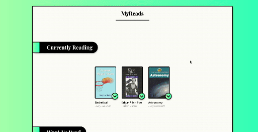

# MyReads app   


A book organizer app. Add, delete, and organize books into three categories.

## About the project
<p align=center>
    </img>
</p>
<p align=center>
    <a href='https://sleepy-citadel-44307.herokuapp.com/'>Live Demo</a>
</p>


<!--  -->
### Description

This is a study project I made, almost from zero. Only a small HTML/CSS base was provided, which I ended up modifyng a lot, beacuse it was ugly :) .The goal was to solidify knowledge while learning React, React-router and state management. Meanwhile I started to wonder what would be the best way to handle CSS, and found out about styled-components, which I ended up using a lot. I like that for sure. First I handled state with classes, but later refactored it to use functions with hooks,
It was part of Udacity-s [React developer](https://www.udacity.com/course/react-nanodegree--nd019) curriculum. 

#### Technologies used
* HTML/CSS/JS
* React (with hooks)
* Styled components

#### Prerequisites
* Nodejs
* npm

#### Install

```
npm install
```

#### Launch

```
npm start
```